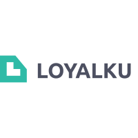

Loyalku processed the data collected from the MOKA POS, then presented it in a format that was easier for MSMEs to digest.

By using Loyalku, MSMEs know their customer retention rates based on certain measurements. The metrics provided by Loyalku can be used by MSMEs to take strategic steps in carrying out customer relationship management.

## Environment Setup

Create `.env` files on root directory:

```bash
CLIENT_ID=your_client_id
CLIENT_SECRET=your_client_secret
REDIRECT_URI=your_redirect_uri
```

## Build Setup

```bash
# install dependencies
$ yarn install

# serve with hot reload at localhost:3000
$ yarn dev

# build for production and launch server
$ yarn build
$ yarn start

# generate static project
$ yarn generate
```

For detailed explanation on how things work, check out [Nuxt.js docs](https://nuxtjs.org).
